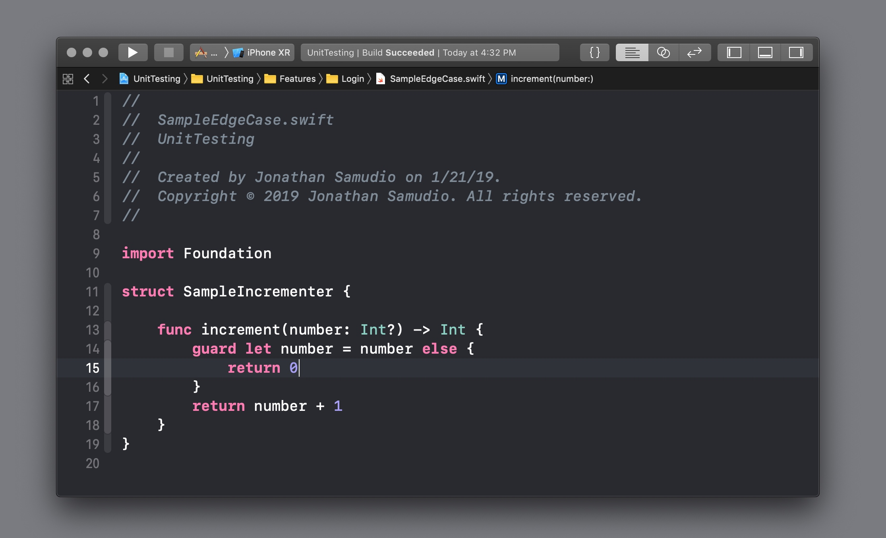
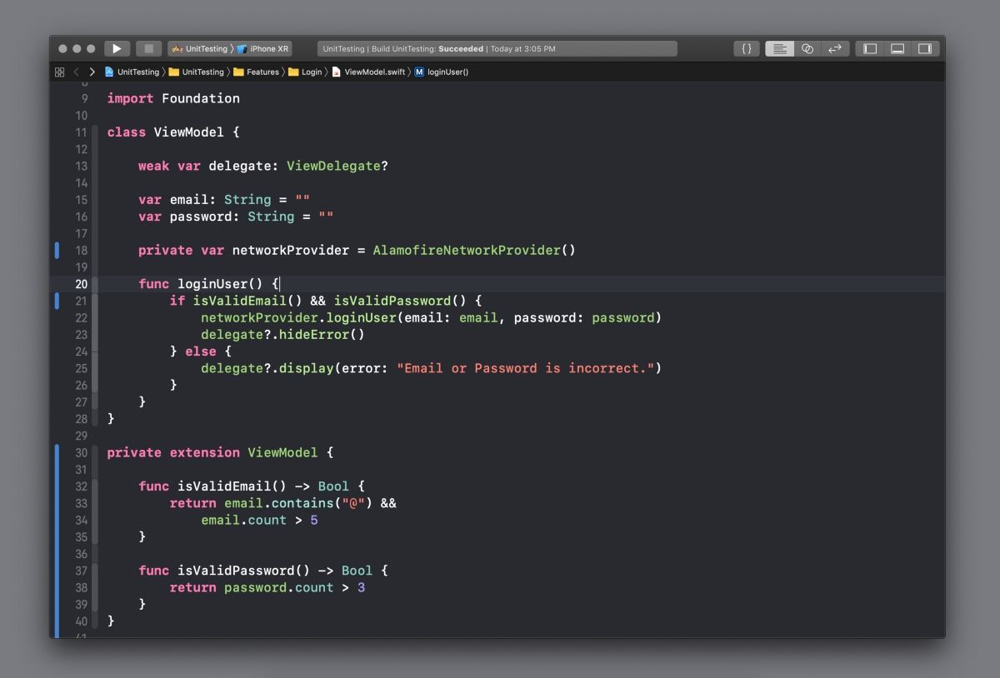
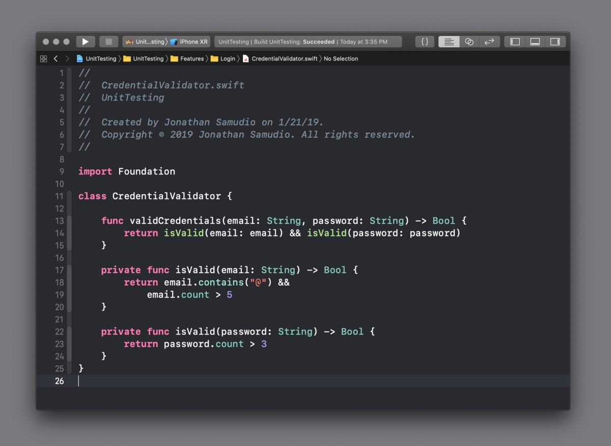

# 5 Steps to Unit Test your Code Daily
https://medium.com/@jonathan2457/5-steps-to-unit-test-your-code-daily-1f36e0827c4

今天就开始测试你的代码.

> 无论您是初学者还是专家，每天进行单元测试都是一项艰巨的任务。

但是总有一些事情阻碍着我们进行单元测试。随着上线的截至日期的来临，团队总会面临压力或者降低责任心，开发人员就会心照不宣的跳过单元测试。但是不用担心，下面有 5 个步骤可以确保你每天都做单元测试。

### 1. 时刻记着单元测试的价值

如果单元测试对你的代码没有任何价值，那么我们没有任何理由去做它。第一步就是记着单元测试的重要性，这是确保我们每天都做单元测试的第一步。

当我们写的代码有着复杂的逻辑时，我们可以很简单的想到明显的边界条件，但是不常见的边界条件才是难以发现的。通过编写复杂逻辑代码的单元测试，它强制要求你检查所有的边界条件，即使这个边界条件很不明显。

在上面的代码里面，这个方法的参数是一个数字，然后返回值是这个数字加上 1 .很简单的逻辑：传入参数 1 返回值为 2 .不过在我们在仔细看看，还有一个额外的条件，如果当参数为 `nil` 时会发生什么？应该返回 0 吗？

如果我们追求的只是这段代码能跑就行，那么这些问题可以被忽略。有时候开发人员并没有意识到添加了一个边界的情况，这个时候就需要添加单元测试去帮助我们发现潜在的问题。

> 当向程序添加新功能时,发现潜在的边界情况就变得很重要.

如果程序发生很大的改变时，但单元测试能及时的发现bug 。可以让开发人员大胆且自信的修改代码。

想象一下，所有的应该修复的 bug 都在开发阶段被发现。

### 2. 不要测试全部的代码

有些团队要求 100% 的单元测试覆盖率，但是这是并不是说写了单元测试就一定比不写单元测试的好。如果所有的代码都需要单元测试，那么整合代码联调测试将会变得很困难。
> 有些代码进行单元测试的重要性比其他的代码要高。比如面向用户的业务逻辑代码应该作为单元测试的最关键代码。

面向用户的业务逻辑的代码会影响用户与 App 交互的方式。当用户点击一个按钮，面向用户的业务逻辑的代码决定了后面会发生什么。

~~有一个很好的标记来确认什么时候你的代码需要单元测试了，那就是当 `if` 或者 `switch` 大量出现在你的代码的时候。~~

当 `if` 或者 `switch` 大量出现在你的面向用户的业务逻辑代码的时候，这个时候你需要对你的代码进行单元测试了。当这种情况发生时，通常的原因是与用户的交互操作充满了复杂的业务逻辑。

### 3. 为单元测试评估充足的时间

虽然可以很容易告诉您的项目经理，因为赶进度随意单元测试需要将减半，但是这不太实际。

> 当考虑到一个任务的开发时间时，要考虑到单元测试这个任务需要的时间。

虽然增加这些单元测试任务可能会导致你的进度慢一点，但是你提交的代码质量会有着显著的提高。

预防这些简单的 bug 进入代码库，最终会在将来节省你的时间。

### 4. 坚持 `SOLID` 的设计原则

如何简单的进行单元测试是阻止开发人员进行单元测试的最大障碍。

> 单元测试的核心是：改变输入值然后查看输出值是否满足预期的结果。

耦合严重的代码是难以测试的，因为很难控制输入和验证输出。为了让单元测试简单点，我们需要提取代码到以便我们方便的访问。

为了提取耦合的代码，我们需要关注 `SOLID` 设计模式中的 `S` 和 `D`。

`SOLID` 是简写，代表了：

>Single Responsibility(单一), Open / Closed Principle(公开/封闭), Liskov Substitution Principle（里氏替换）, Interface Segregation Principle（接口分离） and Dependency Inversion Principle（依赖倒置）.
> [扩展阅读](https://www.cnblogs.com/leaven/p/3920947.html)
> [扩展阅读](https://en.wikipedia.org/wiki/SOLID)

#### Single Responsibility (S)/单一

每个类有且只能有一个功能。如果你要设计一个类，并且它不止负责一件事情，那么这个类需要被进一步的分解。

#### Dependency Inversion Principle (D)

代码中所需的依赖项应包含在接口或协议中，并注入到您的类中。抽象依赖关系能方便的进行 `Mock` 有助有单元测试。

坚持 `SOLID` 的设计原则不仅有助于我们构建灵活的、可维护的代码，而且还可以使单元测试更加容易。

#### 举个 🌰

我们将看到一个可以登录用户的 `ViewModel`。实现了一些基本的电子邮件和密码验证，我们的工作是测试 `ViewModel` 的登录功能。

分析过方法后，我们可以发现 `login()` 方法依赖 `email` 和 `password` 变量，这些变量可以控制输入来进行测试。

现在我们已经确定了输入，我们需要找到可以用来验证的输出，来确保我们的方法按照我们的预期结果运行。

`login()` 函数的唯一可用输出是通过 `networkprovider` 或 `delegate`。需要为这些类创建 `Mock`，以便将它们注入到 `ViewModel` 中进行测试。

仅为 `NetworkProvider` 创建  `Mock` 可能是一项耗时的任务。然而，`login()` 函数面向用户的业务逻辑是电子邮件和密码验证。

验证逻辑可以提取到单独的、易于测试的类中，而不是为 `NetworkProvider` 和 `delegate` 创建 `Mock`。

通过遵循 `SOLID` 原则的 `“S”` ，我们将验证逻辑提取到另一个类中，这个类只有一个职责——验证用户的凭证。

现在，输入和输出都已明确定义。输入是电子邮件和密码，我们可以测试的输出是`validCredentials` 函数的布尔返回。

既然将逻辑提取到独立类中，那么测试电子邮件和密码验证就简单了。

### 5. 实践、实践、实践

每天对代码进行单元测试并非易事。如果您刚开始对代码进行单元测试，这将是一个更大的挑战。但是，无论你是专家还是初学者，越早开始越好。

您不需要对编写的每一段代码进行单元测试，但关键是每天都要练习一点。接下来，您将成为专家，并激励其他开发人员对代码进行单元测试。

### 感谢您的阅读! 🙌

如果您对未来的文章有任何疑问、评论或要求，请在下面留言！