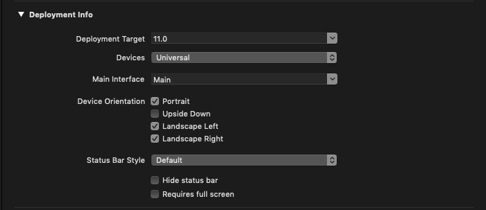
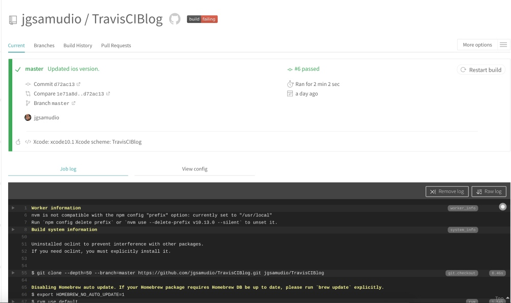
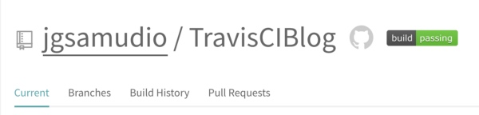
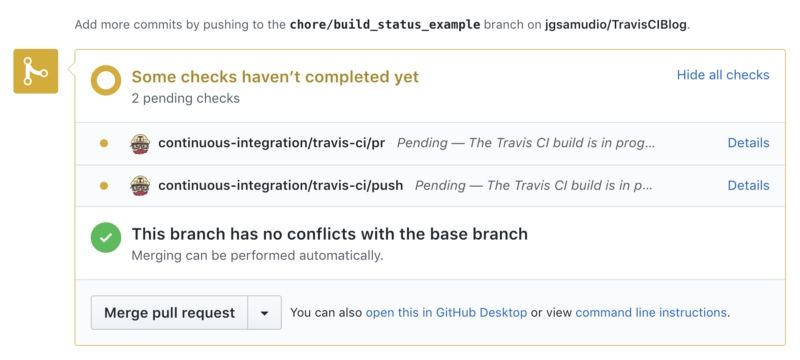

# How to automate CI for any iOS Project

> 原文链接：[How to automate CI for any iOS Project](https://medium.com/@jonathan2457/how-to-automate-ci-for-any-ios-project-c98494d29a44)

每一个项目都应该使用 CI。

### 什么是 CI （ Continuous Integration）？

持续集成（CI）是将所有的新代码合并到主分支的一个过程。目标是维护一个可构建的主分支和通过单元测试来限制bug产生。

听起来不错吧？但是如果我告诉你在合并某些代码前我们的代码正在破坏一些东西呢？What if I told you we can know when our code is going to break something before we actually merge something?

### 自动化构建服务

像  Travis CI, Circle CI, 和 Bitrise 提供了自动化构建的服务。它们允许用户在每一次 Pull Request 的时候自动运行构建服务。

CI build services 使用了一个虚拟的机器来构建项目。通过创建一个新的计算机实例，可以有效的避免一个莫名其妙的错误。譬如：不同版本的 Xcode 编译出来的东西不一致的问题。

这篇文章，我们选择 Travis CI 作为我们的自动构建服务。它可以免费使用并且方便的与 Github 上的开源项目集成。
### Requirements

必须拥有一个 github 账户去同步 Travis CI。一旦激活这个账户，所有公开的项目都可以使用 Travis CI 同步。这篇文章使用的 demo 在[这里](https://github.com/jgsamudio/TravisCIBlog)，包含一个 Xcode workspace， CocoaPods 配置 和一个单元测试的target。

A GitHub account is necessary to sync with Travis CI. Once activated, public repositories from Github are able to sync with Travis CI. The sample repository used in this post is available here. Included is an Xcode workspace, configured with CocoaPods and a unit testing target.

### The YAML File
自动化构建服务可以通过配置 `.yml` 文件来设置和构建任何项目。因为我们使用的 Travis CI 所以我们需要在项目的根目录去创建一个  `.travis.yml` 文件。
下面展示的是一个简单的 `.travis.yml` 文件，用来展示可以定义的属性。


```
language: objective-c
osx_image: xcode10.1
xcode_workspace: TravisCIBlog.xcworkspace
xcode_scheme: TravisCIBlog
xcode_destination: platform=iOS Simulator,OS=12.1,name=iPhone X
before_install:
- pod install
```
#### 1.language 

Travis CI 支持多种语言，包括 Swift 和 Objective-C。设置  `language` 为 `Objective-c` 对这两者都生效。
#### 2.osx_image
要构建的Xcode版本。
在撰写本文时，我们使用的是最新版本Xcode 10.1。
#### 3. xcode_workspace
Xcode工作区文件的路径。对于大多数文件来说，Xcode工作区文件的位置是根目录。要将路径设置为根目录，请将xcode_workspace属性设置为工作空间文件的名称。
如果项目位于子目录中，那么在构建前，需要切换到根目录。在 `before_install` 选项下使用 `cd`命令切换到根目录。
下面是一个简单的例子：工程位于下面的路径 `./Example/TravisCIBlog.xcworkspace`。

```
language: objective-c
osx_image: xcode10.1
xcode_workspace: TravisCIBlog.xcworkspace
xcode_scheme: TravisCIBlog
xcode_destination: platform=iOS Simulator,OS=12.1,name=iPhone X
before_install:
- cd Example
- pod install
```

#### 4. xcode_scheme
CI构建应运行的所需Xcode方案的名称。
所选方案的位置靠近Xcode上的模拟器选择器。


#### 5. xcode_destination
Xcode包含有关模拟器选项的信息。
`platform` 设置为 `iOS Simulator`，`OS` 设置为模拟器的系统版本号，`name` 设置为构建运行的模拟器名称。

请注意，iOS模拟器无法运行所有可用的iOS版本。
例如，iPhone XR不支持在任何版本的iOS 11上运行。限制因素是iOS模拟器无法运行早于设备启动的iOS版本。
iPhone XR随iOS 12.0发布，这就是为什么它无法运行iOS 11，因为它从未在iOS 11中发布。支持的Travis CI模拟器列表可在[这里](https://gist.github.com/jgsamudio/4a38d468c12aaec84cdc5f5b2c77b726)获得。

需要注意的另一个问题是项目的部署目标和所需的操作系统版本不匹配。



Xcode部署目标不能低于.yml文件中的操作系统版本。
如果部署目标较低，则构建将无法在所需的模拟器上运行。
操作系统版本至少需要部署目标或更高版本才能使构建成功。

#### 6. before_install

可以设置任何需要在 CI 开始之前的操作。譬如，我们的项目中使用了 `CocoaPods`，所以 `before_install` 这个选项里面需要添加 `pod install`。

### Triggering a Build 触发构建

配置好 `.travis.yml` 文件后，push 到 Github。
要触发构建，打开项目的主页，找到 `More options` 选项，点击选择 `Trigger Build`。整个过程需要几分钟时间，如果没有错误，将如下图说示：


## Add a Build Status Badge to your README

构建状态标记是从README显示项目当前状态的好方法。
你可能已经注意到一些流行的开源pod在自述文件中有这个。

要添加一个，请转到Travis CI上的项目，然后选择项目名称旁边的 `build passing` 徽章。
徽章应该代表哪个分支以及徽章的类型。
对于类型，选择Markdown以将其添加到README。
生成的文本无需修改即可将其添加到README中。

如果出现任何问题，也可以点击徽章以帮助将开发人员路由到Travis CI构建页面。

### Whats’ next…

现在我们已经为项目添加了CI构建服务，我们可以放心地构建新功能。
在创建新的Pull请求时，Github将自动在Travis CI上创建新的构建。
构建的状态将显示在Pull Request中，如下图所示。


有关如何设置和自定义.travis.yml文件的更多信息，请访问：[Building an Objective-C or Swift Project - Travis CI](https://docs.travis-ci.com/user/languages/objective-c/)

<a href="https://docs.travis-ci.com/user/languages/objective-c/" data-href="https://docs.travis-ci.com/user/languages/objective-c/" class="markup--anchor markup--mixtapeEmbed-anchor" title="https://docs.travis-ci.com/user/languages/objective-c/" rel="nofollow"><strong class="markup--strong markup--mixtapeEmbed-strong">Building an Objective-C or Swift Project - Travis CI</strong><br><em class="markup--em markup--mixtapeEmbed-em">It's important that your device destination uniquely identifies your device among those that Xcode knows about. Since…</em>docs.travis-ci.com</a>